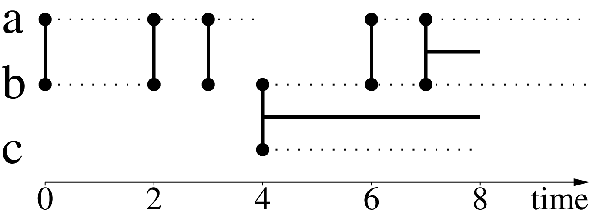

What is a Stream Graph?
-----------------------
A stream-graph is a generalization of a static graph.  
As we know a static graph, is an object :math:`G = (V, E)`, where:

- :math:`V`, is a set of nodes or the **node-set**
- :math:`E \subseteq V \times V`, is a set of links or the **link-set**

.. image:: ./g_example.png
  :width: 400
  :alt: An example of a social-network: Zachary's karate club (1977)

A stream-graph, is an object :math:`S = (V, T, W, Z)`, where:

- :math:`V`, a set of nodes or the **node-set**
- :math:`T`, a collection of time-objects or the **time-set**
- :math:`W \subseteq V \times T`, a collection of temporal-nodes or the **temporal-node-set**
- :math:`Z \subseteq (W \times W) \; / \; T \subseteq V \times V \times T`, a collection of temporal-links or the **temporal-link-set**

Notice that in a stream-graph we can have both **instantaneous** and interactions with **duration**.

Additionally it is important to define a time-signature. Distinction between discrete and continuous time makes a difference on applying operations between temporal-obejects.
All the differences arise from the fact that only for discrete-time, all interactions with **duration**, can be represented as instantaneous interactions and vice-versa.  

We will refer to the **aggregated graph** :math:`G_{S} = (V, E_{Z})` of a stream-graph as the one defined by it's nodeset :math:`V`, and it's **induced** link-set :math:`E_{Z} = {(u, v) | (u, v, _) \in E}` of all the links that appear inside the temporal-link-set.
