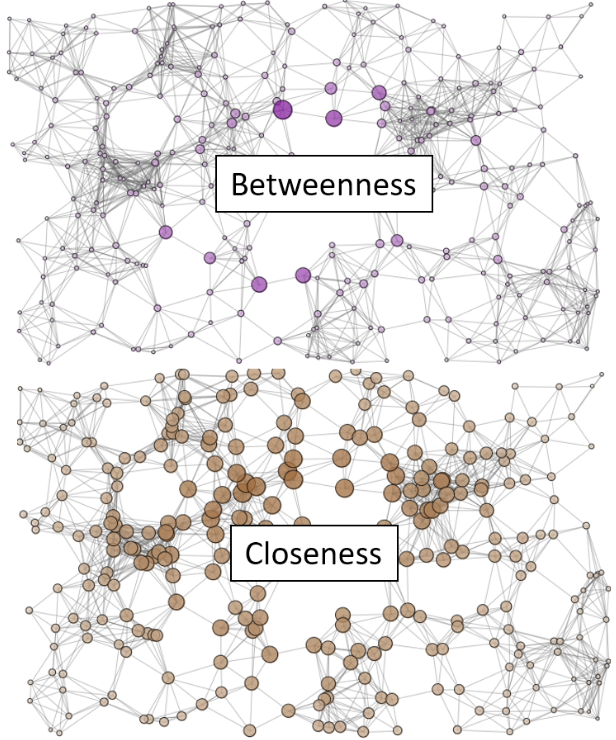
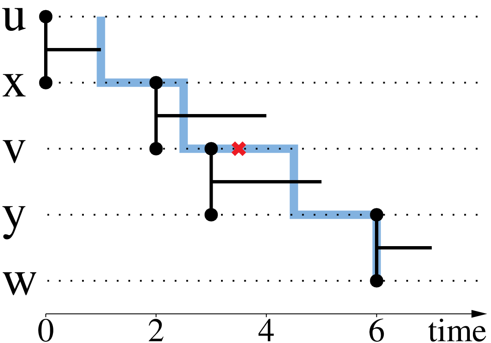

Complex computations
====================

Complex measures and definitions from classical graph-theory have generalized for Stream-Graphs.
Such include distance and shortest-paths, centrality measures, maximal-cliques, k-cores, trees and connected-components.
Additional measures are also added, that emphasize on the temporal-properties of each measure or definition.
Such an example is the jargon shortest-fastest paths as 

Both our package and algorithms and tools in this area are under constant development.
As so, in this section we will only describe those computations that are currently implemented inside our package.

Measures of centrality
----------------------

Measures of centrality, have an importance when we want a measure of how much **central** a node is.
A central node is one which can easily reach all others and which we can also easily reach.
Such a node could optimal, for example when transmiting messages using shortest paths in a cluster of servers, this node will have a huge weight, as most information will try to pass through it.

Closeness-Centrality
--------------------

An introductory measure of centrality is what is defined as closeness centrality (or *closeness*) of a node.
In classical graph theory **closeness** was defined by Bavelas (1950) as the reciprocal of the farness that is:

.. math::

    C(v) = \frac{1}{\sum_{u \neq v}d(u, v)}

The sum of the length of all shortest paths ending at a certain node, define how far a node is and thus the more central a node is, the closer it is to all other nodes.

.. image:: ./cg.png
  :alt: Based on the closeness measure of centrality the **black** node is the one, that is the most central to the above graph.

A **temporal** version of closeness-centrality defined by Matthieu Latapy et al. (2017), is similarly equal to:

.. math::

    C_{t}(v) = \frac{1}{\sum_{u \neq v}d_{t}(u, v)}

Where :math:`d_{t}(u, v)` represents the distance of :math:`u` to :math:`v` at time :math:`t`.
As we can observe, this measure of **temporal** closeness-centrality 1) can vary through time and 2) can be different from the value of the **static** closeness-centrality on the aggregated graph.

The importance of having temporal closeness centrality, can be observed on the following plot:

.. image:: ./closeness_example.png

Notice that this measure of temporal-closeness is different from calculating the classic closeness on the snapshot graph (on the graph active at each time-stamp), as paths of the past have an importance for calculating a value at a current time-stamp.

Betweeness-Centrality
---------------------

The centrality measure of **betweenness**, is formulated on the basis of shortest paths. For every pair of vertices in a connected graph, there exists at least one shortest path between the vertices such that either the number of edges that the path passes through (for unweighted graphs) or the sum of the weights of the edges (for weighted graphs) is minimized. The betweenness centrality for each vertex is the number of these shortest paths that pass through the vertex.

.. math::

    C(v)=\sum_{s \neq v \neq t} \frac{\sigma_{s t}(v)}{\sigma_{s t}}

where :math:`\sigma _{st}` is the total number of shortest paths from node :math:`s` to node :math:`t` and :math:`\sigma _{st}(v)` is the number of those paths that pass through :math:`v`.

A difference of this measure of centrality can be illustrated in the following picture:

In order to reduce it's computational complexity **betweeness** in stream-graphs is computed only at the **ego**-graph.
In classical graph theory an **ego**-graph or a **hop-2** graph, is the graph that is induced by our orignal graph, if we keep the neighbors of each node and their neighbors.
The closeness-measure of **ego-betweenness** at an instant :math:`t` is the sum of fractions of the most recent paths between the pairs of neighbors of :math:`e` on which :math:`e` is located, by considering only the paths contained in the **ego**-stream-graph, i.e. those with length 2.

.. math::

    C(e, t)=\sum_{i, j \in \mathcal{N}_{e} \times \mathcal{N}_{e}} \frac{\rho_{i j}(e, t)}{\rho_{i j}(t)}

where :math:`\rho_{i j}(t)` is the number of most recent paths of length at most :math:`2` from :math:`i` to :math:`j` at time :math:`t` and :math:`
rho_{i j}(e, t)` is the number of these paths that pass through :math:`e`. 

An example of betweeness can be shown in the figure below:

Maximal-Cliques
---------------

A **clique** in a static graph is defined as a set of nodes, where there exists a link between all pairs of nodes (subgraphs of density 1).
As so calculating the **maximal**-cliques calculates the cliques of the biggest possible size, following the idea that if we remove a node in clique we will always have a clique (if it's size is more than :math:`2`).

.. image:: ./graph-clique.png
  :alt: Maximal-cliques on a static graph.

In a similar fashion with static graphs, a clique in a temporal-link-set is a collection of nodes that are all connected with each other, during a given period of time. In a temporal-context **maximal**-cliques, are cliques of the maximum-duration possible and the biggest number of static-nodes.
This follows the idea, that if we remove a node or decrease the duration in a temporal-clique we will continue having a clique, except if the number of static nodes is equal to :math:`2`.

.. image:: ./link-stream-clique.png
  :alt: Maximal-cliques on a stream-graph.

